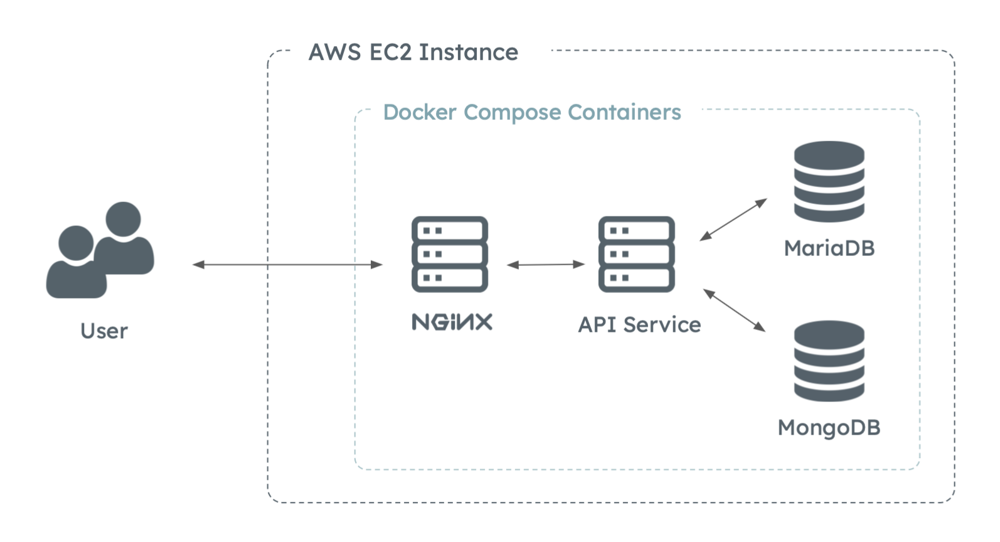

# Fortune Tracker Server

## About This Project
This is a backend api service integrated with MariaDB and MongoDB for an application that manages your daily ledgers. Users can hold personal and shared ledgers to record their daily transactions more conveniently.

The system architecture is as follow : 



## Usage
You can view the API document here : [Fortune Tracker API Document](https://chiehyu.notion.site/Fortune-Tracker-API-Doc-b227f7322b45432faa87bcfd3442343d?pvs=4)

<hr/>

## Run Fortune-Tracker API Yourself
First clone this repository: 
```
git clone https://github.com/yu-niverse/Fortune-Tracker.git
cd Fortune-Tracker
```
Follow the following steps to run the service :

### Prerequisites
1. Executing environment: Linux (Ubuntu)
   <br/> or you can build the docker image yourself from `fortune-tracker-api`
3. Install Docker and Docker Compose
    <br/>( you can run the following script to install the same version )
   
    ```
    chmod +x fortune-tracker-docker/install.sh
    ./fortune-tracker-docker/install.sh
    ```
4. Init Submodule

   ```
   git submodule init
   git submodule update --remote
   ```
5. Configure your own `fortune-tracker-docker/app.env`
   
### Run the Service
```
cd fortune-tracker-docker
docker compose --env-file app.env up -d
```
You can view the status of the containers by running

```
docker compose --env-file app.env ps
```

The log files will be under `api/logs` directory or view the logs manually by running

```
docker compose --env-file app.env logs <service_name>
```
